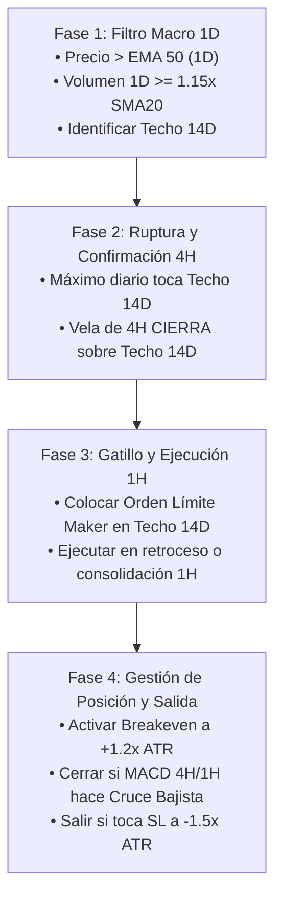

# 📘 Guía Manual de Ejecución: Setup Institucional Multi-Timeframe (1D / 4H / 1H)

Esta guía contiene la **metodología paso a paso** para identificar, calcular y ejecutar manualmente el setup institucional de ruptura multitemporal. Diseñada para practicar en plataformas de gráficos como TradingView antes o en paralelo al trading automatizado.

---

## 🧰 1. Configuración del Gráfico e Indicadores Necesarios

Añade los siguientes indicadores en tu plataforma de gráficos (ej. TradingView):

| Indicador | Temporalidad | Parámetros / Configuración | Función en el Setup |
| :--- | :--- | :--- | :--- |
| **Donchian Channels** | **1D (Diario)** | Periodo: `14` (Excluyendo vela actual) | Identifica la resistencia crítica de 14 días (**Techo 14D**). |
| **EMA (Media Móvil Exponencial)** | **1D (Diario)** | Periodo: `50` | Filtro de tendencia macro (comprar solo si el precio está arriba de la EMA 50). |
| **Volumen con SMA 20** | **1D (Diario)** | Volumen + Media Móvil Simple de `20` periodos | Filtro de inyección institucional (Volumen diario $\ge 1.15 \times \text{SMA}_{20}$). |
| **ATR (Average True Range)** | **1D (Diario)** | Periodo: `14` | Determina la volatilidad para calcular la distancia del **Stop Loss** y el **Breakeven**. |
| **MACD** | **4H y 1H** | Rápida: `12`, Lenta: `26`, Señal: `9` | Regla de salida por agotamiento o reversión tendencial. |

---

## 🎯 2. El Setup en 4 Fases de Confirmación

---

### 📍 Fase 1: Identificación y Filtros Macro en Gráfico Diario (1D)
1. **Localizar el Techo 14D**: Mira el máximo más alto alcanzado por el precio en las **últimas 14 velas diarias cerradas**. Ese nivel es tu **Precio de Resistencia Crítica ($P_{\text{Techo}}$)**.
2. **Verificar Tendencia Alcista**: El precio de cierre diario debe estar **por encima de la EMA 50**. Si está por debajo, **NO SE OPERA**.
3. **Verificar Volumen Institucional**: La barra de volumen diario debe ser mayor o igual al $115\%$ de su media móvil de 20 días ($\text{Volumen} \ge 1.15 \times \text{SMA}_{20}$). Si no hay volumen, **NO SE OPERA**.

---

### 📍 Fase 2: Confirmación Estructural en Gráfico de 4 Horas (4H)
1. Una vez que el precio diario toca o supera el $P_{\text{Techo}}$, **desciende al gráfico de 4 Horas**.
2. Busca que **al menos una vela de 4H CIERRE completamente por encima del $P_{\text{Techo}}$**.
3. *Regla de Oro*: No entres solo porque la mecha traspasó el nivel; exiges el **cierre del cuerpo de la vela de 4H**.

---

### 📍 Fase 3: Gatillo de Precisión en Gráfico de 1 Hora (1H)
1. Con la confirmación de 4H, baja al gráfico de **1 Hora**.
2. **Programación de Orden Pasiva (Maker Límite)**:
   - Coloca una **Orden Límite de Compra (Buy Limit)** exactamente en el precio del $P_{\text{Techo}}$.
   - **Ejecución por Pullback**: Si en las siguientes velas de 1H el precio retrocede a testear el techo roto, tu orden se ejecuta como **Maker** a costo mínimo ($0.02\%$ comisión y cero deslizamiento).
   - **Ejecución por Consolidación (Fallback)**: Si el precio no retrocede al nivel exacto pero la vela de 1H cierra fuertemente consolidada arriba del techo, se ejecuta la compra al cierre de la vela de 1H.

---

### 📍 Fase 4: Gestión Dinámica del Riesgo y Salidas

#### 1. Cálculo del Stop Loss (SL Inicial):
Calcula la distancia de seguridad usando el ATR diario:
$$\text{Distancia SL (USD)} = 1.5 \times \text{ATR}_{14 (1D)}$$
$$\text{Precio Stop Loss} = \text{Precio Entrada} - \text{Distancia SL}$$

#### 2. Candado a Costo Cero (Breakeven Lock):
Monitorea el avance de la operación. Cuando el precio alcance:
$$\text{Objetivo Breakeven} = \text{Precio Entrada} + (1.2 \times \text{ATR}_{14})$$
Mueve inmediatamente tu Stop Loss al **Precio de Entrada exacto**. A partir de este momento, la operación es de **Riesgo Cero ($0 USD)**.

#### 3. Salida por Cruce Bajista MACD (Exit de Reacción):
Observa el indicador MACD en 4H y 1H. Si se produce un **cruce bajista** (la línea MACD cruza por debajo de la línea de señal) en una vela **cerrada** de 4H o 1H:
- **Cierra la posición a mercado inmediatamente**, asegurando la ganancia acumulada o cortando la pérdida antes de alcanzar el Stop Loss.

---

## 🧮 3. Fórmulas de Sizing (Calculadora de Posición en USD)

Para aplicar el **Criterio de Kelly Fraccional al 2%**:

1. **Calcula tu Riesgo Máximo Permitido ($R$)**:
   $$R = \text{Capital Total} \times 0.02$$
   *(Ejemplo: Con $1,000 USD de capital, R = $20 USD).*

2. **Calcula la Distancia del Stop Loss en Porcentaje ($D_{\%}$)**:
   $$D_{\%} = \frac{\text{Precio Entrada} - \text{Precio Stop Loss}}{\text{Precio Entrada}}$$

3. **Calcula el Tamaño de la Posición en Dólares ($S_{\text{USD}}$)**:
   $$S_{\text{USD}} = \min\left( \frac{R}{D_{\%}}, \text{Capital Total} \times 0.25 \right)$$
   *(Límite máximo: NUNCA asignar más del 25% del capital total a un solo activo).*

---

## 📝 4. Ejemplo Práctico Numérico Paso a Paso

Supongamos que vas a operar `AAVEUSDT` con una cuenta de **$1,000.00 USD**:

1. **Fase 1 (1D)**:
   - Identificas que el Techo Donchian de 14 días es **$160.00**.
   - El precio diario está a $161.00 (arriba de la EMA 50 de $145.00).
   - El volumen diario es $1.35\times$ la SMA20. $\rightarrow$ **FILTROS VALIDADOS**.
   - El $\text{ATR}_{14}$ diario es **$8.00 USD**.

2. **Fase 2 (4H)**:
   - Una vela de 4H cierra en **$162.50** (por encima de $160.00). $\rightarrow$ **CONFIRMADO**.

3. **Fase 3 (1H)**:
   - Colocas Orden Límite de Compra en **$160.00**.
   - El precio en 1H hace un retroceso hasta $160.00$ y ejecuta tu orden.
   - **Precio de Entrada ($P_E$)** = **$160.00**.

4. **Cálculos de Riesgo**:
   - Distancia SL = $1.5 \times \$8.00 = \$12.00$.
   - **Precio Stop Loss (SL)** = $\$160.00 - \$12.00 = \mathbf{\$148.00}$.
   - Distancia SL $\%$ = $(\$160.00 - \$148.00) / \$160.00 = 0.075$ ($7.5\%$).
   - Riesgo USD ($R$) = $\$1,000 \times 0.02 = \mathbf{\$20.00 USD}$.
   - Tamaño Posición = $\$20.00 / 0.075 = \mathbf{\$266.67 USD}$ (menor al tope de $250 USD, se ajusta a **$250.00 USD**).

5. **Gestión de la Operación**:
   - Nivel Breakeven = $\$160.00 + (1.2 \times \$8.00) = \mathbf{\$169.60}$.
   - Si `AAVE` sube a **$169.60**, mueves tu SL a **$160.00** (Riesgo Cero).
   - Si en 4H o 1H el MACD da cruce bajista en $175.00, vendes a mercado cerrando con **+$23.40 USD de beneficio neto**.

---

## 📋 Checklist Manual de Verificación Pre-Trade

Antes de presionar el botón de compra, responde SÍ a cada casilla:

- [ ] **1. ¿El precio actual está POR ENCIMA de la EMA 50 en el gráfico Diario (1D)?**
- [ ] **2. ¿El Volumen Diario es SUPERIOR al 115% de su media móvil de 20 periodos?**
- [ ] **3. ¿La vela de 4 Horas CERRÓ por encima del Techo Donchian de 14 Días?**
- [ ] **4. ¿Tengo calculada la distancia de Stop Loss como $1.5 \times \text{ATR}_{14}$?**
- [ ] **5. ¿El riesgo en Dólares es exactamente el 2% de mi capital (sin apalancamiento excesivo)?**
- [ ] **6. ¿Tengo fijada la alerta para activar Breakeven al alcanzar $+1.2 \times \text{ATR}_{14}$?**

> [!TIP]
> **Recomendación de Práctica**: Utiliza la herramienta "Bar Replay" (reproducción de barras) de TradingView en datos históricos para simular 20 operaciones manuales siguiendo este checklist y verificar tu disciplina operativa.
