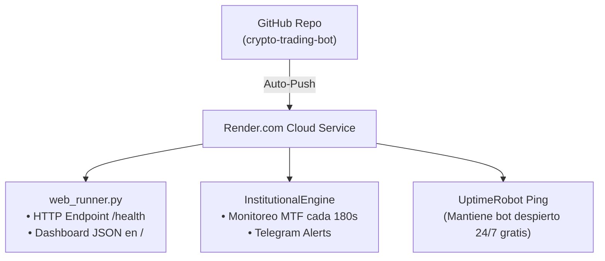

# ☁️ Guía de Despliegue en Render (Render.com Deployment Guide)

**Render (render.com)** es una plataforma de nube moderna ideal para probar, monitorear y hacer correcciones continuas en tu bot de trading antes de pasar a producción con dinero real.

---

## 🌟 ¿Por qué Render es perfecto para esta fase de pruebas?

1. **Despliegue Automático con Git (Push-to-Deploy)**: Cada vez que hagas un cambio o corrección en tu código y lo subas a GitHub, Render compilará y actualizará el bot automáticamente en segundos.
2. **Dashboard Web e Inspección de JSON**: Con el archivo [`web_runner.py`](file:///C:/Users/victo/.gemini/antigravity/scratch/trading_bot/web_runner.py), Render expone una API web donde puedes entrar desde tu teléfono o navegador web a `https://tu-bot.onrender.com/` y ver en tiempo real el capital, ganancias, y posiciones abiertas en formato JSON.
3. **Logs en Vivo**: Render te muestra en tiempo real en la pantalla todos los escaneos, compras, ventas y alertas de Telegram.

---

## 🚀 Paso a Paso para Desplegar en Render (100% Gratuito / Plan Free)

### Paso 1: Crear un Repositorio en GitHub
1. Ve a [github.com](https://github.com) y crea un nuevo repositorio llamado `crypto-trading-bot` (puede ser Privado).
2. Sube los archivos de la carpeta `C:\Users\victo\.gemini\antigravity\scratch\trading_bot\` a tu repositorio en GitHub.

---

### Paso 2: Crear Cuenta y Conectar GitHub en Render
1. Entra a [render.com](https://render.com) y regístrate usando tu cuenta de **GitHub**.
2. En el panel principal (Dashboard), haz clic en **New +** y selecciona **Web Service**.
3. Selecciona tu repositorio `crypto-trading-bot` y presiona **Connect**.

---

### Paso 3: Configurar el Servicio Web en Render
Rellena el formulario de configuración con los siguientes datos:

- **Name**: `quant-trading-bot`
- **Region**: `Oregon (US West)` o la más cercana.
- **Branch**: `main` (o `master`).
- **Runtime**: `Python 3`.
- **Build Command**: `pip install -r requirements.txt`
- **Start Command**: `gunicorn web_runner:app --bind 0.0.0.0:$PORT --workers 1 --threads 2`
- **Instance Type**: Selecciona el plan **Free** ($0 / month).

---

### Paso 4: Agregar Variables de Entorno (Environment Variables)
Desplázate hacia abajo hasta la sección **Environment Variables** y agrega las siguientes claves:

| Key | Value | Descripción |
| :--- | :--- | :--- |
| `TELEGRAM_BOT_TOKEN` | `Tu_Token_De_Telegram` | Token devuelto por BotFather. |
| `TELEGRAM_CHAT_ID` | `Tu_Chat_ID` | ID de tu chat de Telegram. |
| `CHECK_INTERVAL_SECONDS` | `180` | Frecuencia de escaneo en segundos. |
| `INITIAL_CAPITAL` | `1000.0` | Capital inicial demo. |

---

### Paso 5: Desplegar y Verificar
1. Presiona el botón **Create Web Service**.
2. Render comenzará a compilar el proyecto y en 1-2 minutos verás en los logs:
   ```text
   ==> Deploying...
   🚀 [RENDER CLOUD] Hilo secundario del bot iniciado correctamente.
   --- [CICLO EN LA NUBE RENDER #1] ---
   [14:00:00 UTC] 🔍 Escaneando Whitelist Institucional de OKX SPOT...
   ```
3. Copia la URL pública proporcionada por Render (ejemplo: `https://quant-trading-bot.onrender.com/`).
4. Entra a esa URL desde cualquier navegador web o tu teléfono para ver el estado de tu portafolio en vivo.

---

## 📌 Evitar que Render suspenda el Web Service Gratuito (UptimeRobot / Cron Ping)

Los servicios **Free** de Render entran en suspensión de inactividad si no reciben peticiones HTTP durante 15 minutos. Para mantener tu bot **despierto las 24 horas del día de forma 100% gratuita**:

1. Ve al servicio gratuito de pings [uptimerobot.com](https://uptimerobot.com).
2. Crea un monitor tipo **HTTP(s)** con URL: `https://quant-trading-bot.onrender.com/health`.
3. Establece la frecuencia de ping cada **5 minutos**.
4. ¡Listo! UptimeRobot enviará una petición cada 5 minutos manteniendo tu bot en Render despierto 24/7 sin pagar nada.

---

## 📊 Resumen de la Arquitectura de Archivos Creados



- **`web_runner.py`**: Servidor web Flask que expone el estado de la cartera y ejecuta el bucle de trading de fondo en un hilo secundario.
- **`requirements.txt`**: Dependencias de Python (`pandas`, `numpy`, `requests`, `flask`, `gunicorn`).
- **`render.yaml`**: Archivo de infraestructura como código para despliegue automatizado.
