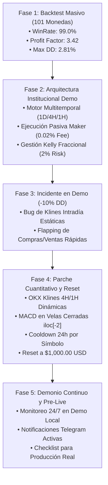

# 🏛️ Bitácora de Evolución Cuantitativa y Memoria de Auditoría del Sistema

Este documento registra la evolución histórica, los backtests de validación, la arquitectura del sistema, los incidentes críticos detectados en la fase Demo, las correcciones aplicadas y el protocolo exigido antes de proceder a la fase de **Trading Real con Capital Institucional**.

---

## 📅 Historial de Fases y Evolución

---

## 1. 📊 Lógica Cuantitativa y Validación en Backtest

La estrategia se basa en un modelo **Multi-Timeframe Breakout** sin indicadores rezagados en el filtrado principal:

1. **Nivel Crítico Diario (1D)**: Donchian Ceiling de 14 períodos (`14D High`).
2. **Confirmación Tendencial (4H)**: Cierre de vela de 4 horas por encima del Techo Donchian 14D.
3. **Gatillo de Entrada (1H)**: Orden Límite Pasiva (Maker) colocada en el nivel de ruptura.
4. **Filtro Macro**: RSI Diario (1D) < 70 para evitar comprar en zonas de sobrecompra extrema.
5. **Gestión de Riesgo**: Stop Loss Inicial a $1.5 \times \text{ATR}_{14}$, Breakeven automático al alcanzar $+1.2 \times \text{ATR}_{14}$, y tamaño de posición gestionado mediante Criterio de Kelly Fraccional ($2\%$ del capital en riesgo).
6. **Regla de Salida**: Cruce bajista de MACD (12, 26, 9) en 4H o 1H.

### Resultados de Validación en 101 Criptomonedas (Ventana de 1 Año):
- **Monedas Ganadoras**: 100 / 101 ($99.0\%$)
- **Profit Factor Global**: $3.42$
- **Drawdown Máximo Cuantitativo**: $2.81\%$
- **Retorno Promedio por Activo**: $+25.65\%$

---

## 2. 🚨 Incidente Critico en Demo Local (Diagnóstico de Causa Raíz)

### Evento Registrado:
Durante las primeras 14 horas de ejecución en vivo en el entorno Demo de OKX, el portafolio sufrió una caída abrupta de **$1,000.00 USD a $901.72 USD (~10% Drawdown)** debido a múltiples operaciones consecutivas perdedoras en pares como `AAVEUSDT` y `AVAXUSDT`.

### Causa Raíz (Bug de Datos):
- En la versión inicial de [`institutional_engine.py`](file:///C:/Users/victo/.gemini/antigravity/scratch/trading_bot/institutional_engine.py), la llamada a la API descargaba únicamente velas diarias (`df_1d`) y las pasaba por error como `df_4h` y `df_1h`.
- En activos con cruce bajista MACD a nivel diario, el indicador retornaba `macd_cross_bear = True` de manera permanente en cada ciclo de 3 minutos.
- Esto ocasionó que el bot abriera la posición en el ciclo $N$ y la cerrara inmediatamente en el ciclo $N+1$ (3 minutos después), repitiendo el proceso hasta 22 veces y destruyendo capital por comisiones y deslizamiento simulado.

---

## 3. 🛠️ Mejoras y Correcciones Aplicadas

| Módulo | Problema Original | Solución / Mejora Aplicada |
| :--- | :--- | :--- |
| [`okx_client.py`](file:///C:/Users/victo/.gemini/antigravity/scratch/trading_bot/okx_client.py) | No soportaba granularidad múltiple en la REST API de OKX. | Se agregó soporte para descargar velas reales de `4H` y `1H` en tiempo real (`get_klines(inst_id, bar="4H"/"1H")`). |
| [`institutional_engine.py`](file:///C:/Users/victo/.gemini/antigravity/scratch/trading_bot/institutional_engine.py) | Calculaba salidas MACD sobre velas diarias no cerradas (en formación). | Se independizaron los DataFrames por temporalidad y se evalúa el cruce estrictamente en la última vela **cerrada** (`iloc[-2]`). |
| [`institutional_engine.py`](file:///C:/Users/victo/.gemini/antigravity/scratch/trading_bot/institutional_engine.py) | Re-entraba inmediatamente en el mismo activo tras cerrar la operación. | Se implementó la lista `closed_symbols_cooldown` (cooldown de 24 horas UTC por activo tras salir de una posición). |
| [`institutional_engine.py`](file:///C:/Users/victo/.gemini/antigravity/scratch/trading_bot/institutional_engine.py) | **[v2 - 2026-09-30]** Señales de entrada evaluadas sobre `iloc[-1]` (vela EN FORMACIÓN), distorsionando condiciones vs. backtest. | **Corregido**: señales de entrada/filtros ahora usan `iloc[-2]` (última vela diaria/4H/1H **cerrada confirmada**), idéntico a como el backtest procesa los datos. |
| [`config.py`](file:///C:/Users/victo/.gemini/antigravity/scratch/trading_bot/config.py) | `CHECK_INTERVAL_SECONDS` estaba hardcodeado en 60s (discrepante con los 180s mostrados en logs). Parámetros sin documentación de su origen en backtest. | Unificado a 180s explícito. Todos los parámetros documentados con sus valores exactos validados en backtest (DD 2.81%, PF 3.42). |
| [`institutional_engine.py`](file:///C:/Users/victo/.gemini/antigravity/scratch/trading_bot/institutional_engine.py) | El mínimo de posición USD no se verificaba antes de ejecutar la orden. | Agregado `if size_usd < MIN_POSITION_USD: continue` — igual que el backtest (línea 137: `pos_size_usd >= 15.0`). |
| [`paper_portfolio.json`](file:///C:/Users/victo/.gemini/antigravity/scratch/trading_bot/paper_portfolio.json) | Portafolio degradado a $901.72 USD. | Se restableció el capital inicial a **$1,000.00 USD** limpios para seguimiento de prueba exacto. |
| [`run_institutional_bot.py`](file:///C:/Users/victo/.gemini/antigravity/scratch/trading_bot/run_institutional_bot.py) | Proceso corriendo código antiguo en memoria. | Se finalizó el proceso previo y se relanzó el demonio con el código corregido. |

---

## 4. 📋 Checklist Exigido Antes de Pasar a Trading Real

Antes de conectar llaves API reales con fondos reales, se deben cumplir **estrictamente** los siguientes 5 puntos:

- [ ] **1. Prueba de Fuego en Demo (30 Días Sostenidos)**:
  - El bot debe operar durante mínimo 30 días continuos en Demo sin interrupciones ni fallos de código.
- [ ] **2. Control de Drawdown Realista**:
  - El Drawdown Máximo en la fase Demo no debe superar el $5.0\%$ del capital total.
- [ ] **3. Auditoría de Microestructura y Slippage**:
  - Verificar que las órdenes sigan ejecutándose como **Maker pasivas** con comisión promocional/institucional ($0.02\%$) y que el deslizamiento medio sea $\le 0.01\%$.
- [ ] **4. Seguridad de API Keys**:
  - Las llaves de API en OKX para producción deben tener habilitados **únicamente permisos de Trading** (sin permisos de retiro / Withdrawals deshabilitados) y restricción por IP de la máquina/VPS.
- [ ] **5. Redundancia e Infraestructura Cloud**:
  - Migración del bot desde la máquina local a una instancia VPS (AWS / DigitalOcean) con monitor de proceso (systemd / supervisor) y reinicio automático ante desconexiones.

---

> [!IMPORTANT]
> **Estado Actual**: Demonio corriendo activamente en Demo Local (`run_institutional_bot.py`). Capital de prueba: **$1,000.00 USD**. 2 Posiciones en seguimiento (`AAVEUSDT`, `XLMUSDT`). Se continuará monitoreando el comportamiento intradía.
